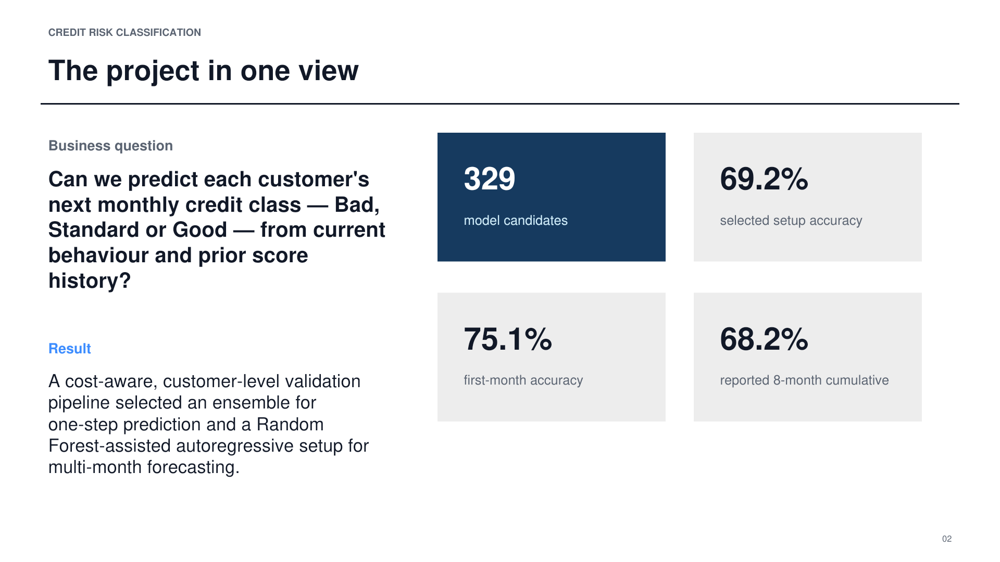

# Credit Risk Classification — Portfolio Case Study

An R-based machine-learning project that predicts a customer's next monthly
credit class (**Bad, Standard or Good**) from behavioural variables and previous
credit-score history.

## Project at a glance

| Scope | Result |
|---|---:|
| Customers | 12,500 |
| Monthly records | 100,000 |
| Observation window | 8 months |
| Candidate models | 329 |
| First-month accuracy | 75.1% |
| Reported 8-month cumulative accuracy | 68.2% |

## Why I built this project

Credit-risk decisions should not be evaluated only by overall accuracy. A model
that classifies a high-risk customer as low risk can create more downside than
the opposite mistake. I therefore compared several classification methods and
evaluated both predictive performance and the direction of errors.

## Method

1. Validate the longitudinal customer-month dataset.
2. Remove month 1 from the one-step experiment because no previous score exists.
3. Split train and test sets by customer, not by row.
4. Select one test month per held-out customer.
5. Tune each model with customer-level five-fold cross-validation.
6. Evaluate accuracy, macro recall, macro specificity and two cost-aware metrics.
7. Compare base models with a weighted probability ensemble.

## What I built

- A customer-level five-fold validation design to reduce identity leakage.
- Elastic Net, Random Forest, XGBoost and LightGBM base models.
- Blending and weighted ensembles across 329 candidate configurations.
- A cost-weighted metric that penalises **Bad → Good** errors more strongly.
- A sequential eight-month forecasting experiment with Random Forest imputation, dropout and feature-selection tests.

## Key findings

1. The ensemble produced the strongest one-step benchmark result (approximately 82.5% in the source chart).
2. The selected sequential setup achieved about 69.2% accuracy and reached 75.1% for the first forecast month.
3. Accuracy declined as predictions were recursively fed into later months, demonstrating forecast-error propagation.
4. Model selection must consider both overall accuracy and the direction of credit-risk mistakes.

## Tools

R, Random Forest, XGBoost, LightGBM, Elastic Net, customer-level cross-validation, ensemble modelling and cost-aware evaluation.

## Important evaluation note

The 82.5% one-step benchmark, 69.2% selected sequential setup and 68.2% reported cumulative figure come from different evaluation views in the original project. They should not be presented as directly comparable scores. The portfolio deck keeps these contexts separate.

## Recommended next steps

- Add a strictly time-based out-of-time holdout.
- Report confusion matrices, per-class precision/recall and macro F1.
- Calibrate probabilities and set decision thresholds by business cost.
- Test fairness and stability across demographic and customer segments.
- Package preprocessing and scoring into a reproducible inference pipeline.
